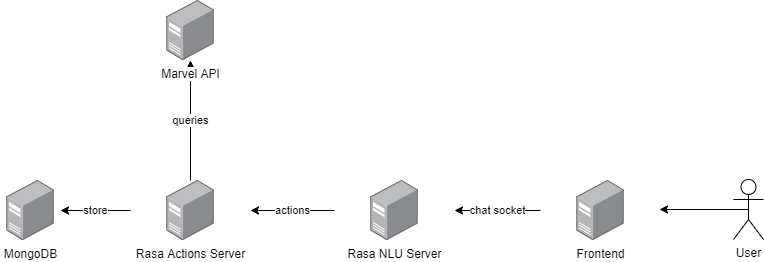
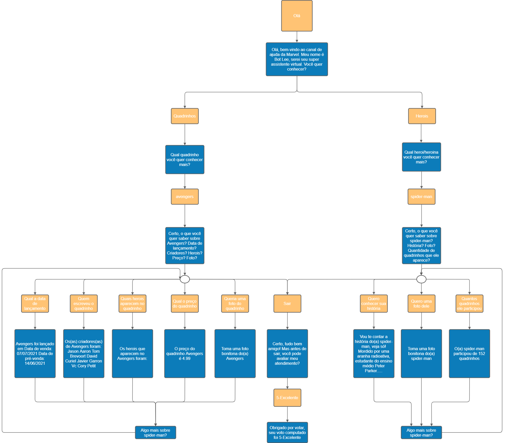
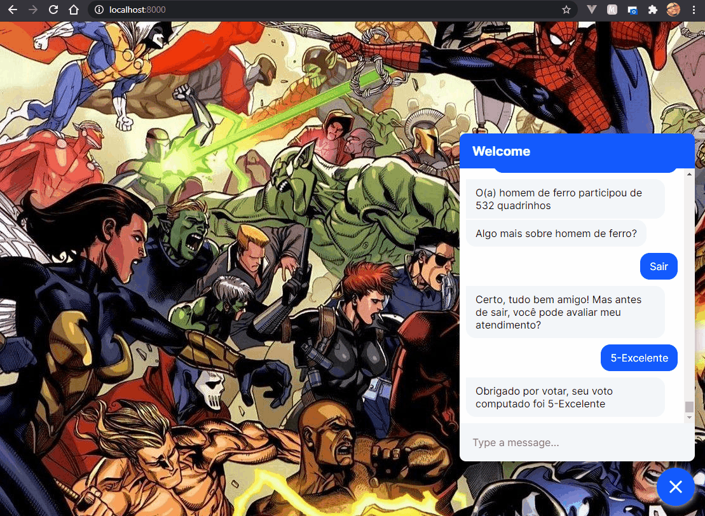
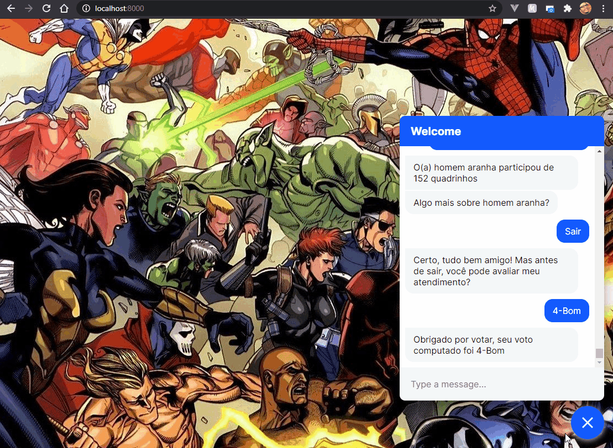

# ChatBot Marvel

Projeto da pós graduação em Data Science da FURB para demonstração do uso de chatbots.

Integrantes:
- Cristopher Braatz Cardoso
- Leandro Vilson Battisti
- Lucas Amaral

## Arquitetura

- Rasa 2.5
- MongoDB 4.5
- Python 3.8

## Dependências

- Docker ([clique aqui para instalar](https://www.docker.com/products/docker-desktop))
- Caso desejar gerar um novo modelo NLU, deve ser instalado o Rasa ([clique aqui para instalar](https://rasa.com/))

## Como é a arquitetura do chatbot?

## Como é o fluxo do chatbot?

## Exemplo de fluxo sobre herois

## Exemplo de fluxo sobre quadrinhos

## Como executar o chatbot?

Após instalar o Docker e executá-lo, no diretório raiz deste projeto, execute o comando `docker-compose up`.

Para acessar o frontend, [clique aqui](http://localhost:8000).

Para acessar a base de dados, [clique aqui](http://localhost:8081).

## Como gerar o modelo NLU?

Basta acessar o diretório `./rasa_nlu` e executar `rasa train`

## Como gerar métricas?

Execute no diretório raiz deste projeto `python ./metricas/script_exportar_metricas.py` ou `python3 ./metricas/script_exportar_metricas.py`.

Serão salvos os arquivos `./metricas/metricas.csv` e `./metricas/votes.csv` no diretório em questão.

## Como utilizar as métricas para gerar insights?

Carregar arquivos `./metricas/chatbot_marvel_metricas.ipynb`, `./metricas/metricas.csv` e `./votes.csv` no Google Colab ou Jupyter e executar `./metricas/chatbot_marvel_metricas.ipynb`
